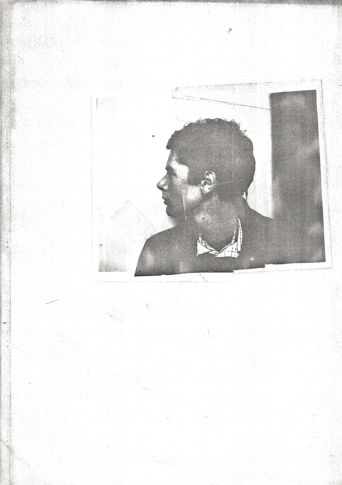

SATURDAY\
small window\
two in a sleeping bag\
flesh bodies\
snoring\
Kate asleep me awake\
looking at the ceiling\
half off the mattress\
struggling ineffectually for a good position\
\"more comfortable if you get out\" she said\
no\
unzipping the sleeping bag using it as a blanket\
two bodies under it\
the light on Kate\'s face\
without her glasses\
light thru the sleeping bag\
gradually getting lighter thru the window\
the door bell\
Kate goes\
other people\
John\
goes for milk for tea returns\
has cigarette\
head sore stop smoking again\
Kate tells John to make tea - shouting\
small talk new table things moron\
talk of jumble sale\
voices Sara and les in next room\
Kate going and coming - who\'s that?\
ice cream van\
me lying naked\
music\
lightweight nylon sleeping bag\
length or time (naked)\
lying looking at poster - void - window - effects of photographic lith\
almost asleep - almost awake\
no desire to move (like cat)\
content (but aware of the end)\
future outside arranged\
curled up - you look like you\'ve got no legs\
Kate gets dressed (shyness - modesty) hope for total reality - freedom\
lie on\
voices downstairs - Kate and Dave\
need for a piss - must now get up\
getting dressed (covering up in case anyone enters)\
singing (Alabama)\
reading bits of poetry\
conscious of Sara in the next room\
poem for Leonard Cohen - in your photograph you\'ve got only one eye\
talking nothing to myself\
mumbling (typical fashion)\
happy (content)\
down stairs\
Dave (embarrassed concern over his reaction)\
fine\
great\
feeling awkward\
Kate letter writing\
different (normal)\
other place\
people\
hello to Sara\
to the toilet (dog shit)\
hanging about\
pick a book\
latin - reading without understanding\
sounds\
tea (strong)\
sore head\
talk - everyday\
to the jumble sale\
head sore\
bus stop (small)\
Kate happy - Dave says she will be depressed all afternoon\
Aw you\'ll bee de-pressed awl aftr-nuon man\
bus\
Dave pays (fiver)\
sit on own\
sore head\
out the window\
don\'t know destination\
want to get off\
people\
girl\
man (hair)\
round about route\
off (Mick - Mike)\
jumble sale 10.30\
stumped\
go home\
what will you do?\
go for coffee then maybe the library then home\
go for coffee\
down Northumberland Street - talking to dave - Kate & Sara ahead\
stop for cigarettes\
lot of people - leave\
Kate & Sara stop to buy candles\
christian\
women!\
pregnant girlfriends\
Bri\'s father\
strange (man stops)\
offers sweet\
talk\
Sara & Kate on ahead\
follow them\
traffic lights\
coffee rooms\
coffee - cheese sandwich (Kate)\
talk - sophisticated ladies - feather baas - easy life\
broken saucer\
the man\
walk towards bus stop\
tobacconist\
Dave and I pretend to steal books\
look at post cards\
girls (excited buy cigarette holders and number six\
into the street\
girls in limelight\
watching them - sore head - feeling numb\
Kate laughs and number six falls out\
holding cigarette holders in the air\
(Dave and myself the same hight - Kate and Sara the same hight)\
they try and act like Greta Garbo etc.\
were going home now you can come back if you like and help make a meal\
strange - aimless - everyone has something to do to be - not me\
the bus comes\
goodbye - baffled (embarrassed) unable to perform a normal goodbye\
scratch my head and walk away mumbling\
wander automatically to the library\
glance at cinema books\
look thru painting books (looking for particular photograph of Gauguin)\
take book about Whistler (phrase on back - bits about Rossetti)\
(Whistler's worldliness had little or nothing of shrewdness in it he
wore his pretensions on his sleeve or rather in the cut of his clothes
in the shrill falsetto of his laugh, and in the extravagances of living
on credit. The luxuries of living were his all too obvious necessities.
The professional artists among his London contemporaries, from the
British Millais to the American Sargent, had solid professional
accomplishment; they had learned to work serenely, to fetch high prices
for their work in an age when art commanded the highest material rewards
that England had ever known. in their company Whistler was never the
solid man, yet he had pretensions to the rewards they had earned through
professional skill. In their eyes and in the eyes of Victorian London he
behaved (a fact that he admitted readily) as though the world owed him a
living.)\
Whistler photograph (pose)\
new suit? only feel uncomfortable - perhaps\...\
Modigliani (grey velvet suit)\
Anais Nin (bits)\
tired of reading (unreal - irrelevant?)\
leave library heading for shoe lace shop\
Playland - unthinking entertainment - 20p\
last 1p lost - leave\
forget about shoelaces\
see a man with a Burl Ives beard standing surveying the scene\
(seen him doing the same thing earlier in front of Marks & Spencer\'s)\
people - trendy heavies (football match) what is in their heads?\
perhaps what I feel (creative pressure) is a physiological flaw\
(Nietzsche man in the end)\
book shop - second hand department\
art and collecting shelves - nothing interesting\
look for section on travel - isn\'t one\
person with same coat\
look at new books - Thames & Hudson art books\
leave (numbed despair and disgust) postcards (quick glance)\
street shops\
pork roll\
football match\
walking slow\
different route this time\
flats (working class) broken windows and washing\
fizzy orange drink bought in newsagents shop\
doing nothing except walking slowly looking at what\'s in front of my
eyes\
(hardly thinking)\
aren\'t you a bit young to be doing this - probably\
uncomfortable in my own clothes (don\'t look like a movie star - no
style)\
easier if I could wear what people could give me\
men (on the dole) possibly feeling the same as myself about this use of
time\
the houses - pubs - betting offices\
decide to write about today - using life - retreat into creative\
Henry Miller\'s idea (Day of the Assassins - on Rimbaud)\
back of the school\
walking\
thru the mud - walk in it or not?- can\'t make decision\
walk in mud because its in my path - could alter my path\
look at the the toys (think of play)\
effect of policeman in police van\
laundrette\
don\'t just sit there become a nurse! (smiling people in a poster)\
buy a model aeroplane kit? (no)\
into the house\
determined to write for hours about the day - straight as it comes\ 
4 o\'clock Mike and Lee still in bed\
Spanish Rose\
I decided to either fall either madly in love or become a heroin addict\
which did you decide on?\
neither\
get typewriter - feel all I have to do is sit down and it will pour out\
first, get cigarettes and chianti to put me in the right mood\
(started smoking again)\
wearing Belfast jacket\
buy wine almost buy cigar\
cigarettes (newsagents)\
walk quickly back - mind keyed to write all night\
Silver - old man\
try and dodge out of sight (no hope)\
have to ask him in (he says he will leave in half an hour)\
give him some wine where are the others?\
Sid & Carol in London - hitching (he says he is too old)\
Mike upstairs with young lady \...\
he sits on hard seat\
foul wine\
two chops - I refuse though haven\'t eaten (hungry but not interested)\
says he was asking for \"Belfast\" at other houses in the street\
had been round before with presents\
offers a chair & mattress\
difference in ages (beginning and end)\
talks of how he likes to talk to people\
thrown out of Milvain\
Fox & Hounds - 3 questions to students 1p i f they don\'t answer\
what were the 3 questions? - no answer\
they owed him 3p - offered to pay but I don\'t need anyone\'s money\
hasn\'t been out of the house for a week\
Mike comes down stairs - Look who\'s here\
have you got a little flower up there?\
yea\
ask her to come down\
what as she is with no clothes on?\
oh!\
you people are beyond me\
mike makes coffee\
goes to get Lee\
she\'ll be down in a minute\
makes her walk back and forth\
cigarette - lipstick ritual (intimate)\
no lipstick\
scribbler poems\
what attracted you to this man here?\
Lee centre of attention\
she says because Mike didn\'t act drunk when he was\
Silver asks how\
poems - miniskirts (his voice)\
what are you people doing to-night\
wants to take us for drink\
or buy some\
Lee doesn\'t drink - not even sherry more wine\
more wine\
I feel as if he\'s killed the urge to write - pulled me back to real
life\
but still hope to try\
pretend I am going to spend the evening studying\
film - pretend it\'s on earlier\
eventually he leaves\
film later than I said\
sit at typewriter (Van Morrison music) wine effect\
stop after three lines\
frustrated\
make notes then type\
Lee leaves - back in an hour\
working wind - mind focused\
Street Life - Roxy Music\
jumpy\
can\'t wait for Lee\
leave - agreed to meet in Poly union then go to film - Monty Python Dr
Strangelove\
Belfast jacket\
bus stop - can\'t stand still\
Sid\'s acquaintance - waiting long? (no hesitation - focused on present)\
he follows me up-stairs on bus but sits behind me (relief)\
few notes\
bus\
big youths in front seat repeatedly sing roll me over in the clover\
(intense feeling)\
off bus (Bigg market)\
heading for union - no reason - searching\
toilet - homosexual\
go in corner\
leave behind man\
street dark - air - windows\
lights - smell - lack of people\
self in windows\
smoking fast\
Northumberland St for 2nd time\
I said over and over and over again this dance is going to be a drag\
sing that over and over - rhythm - walking - atmosphere\
Poly Union\
bar - Kate Sara and Les - glad - am not surprised - plot thickens\
Dave mending radiogram - Kate says I look like Cliff Richards\
Sara all dressed up\
May West impersonations - cigarette holders\
come up and see me some time\
beside Kate - shoulder\
she has toothache\
distant\
film - Dr Strangelove - Kate seen it already\
leave slowly\
Kate Mike & Lee Les & Sara me behind singing midnight special\
night air darkness\
cigarettes (Kate left hers in Union)\
do you want to go back and get them?\
no\
Kate bus stop - she goes home\
Mike & Lee Les & Sara\
me walking slowly behind - Northumberland St again (couples everywhere)\
Sara turned round once and called\
alone - need for other half - no one I know fits\
cinema - queue\
too much\
dart round corner\
off down street (to a certain extent a load off my mind)\
across streets - fuck the cars (and drivers)\
thinking too fast in one direction\
walk - bottom of Barrack Rd again\
a drunk across street leaning symbolically enough against graveyard
railings\
thought of helping - need for flow between people\
don\'t bother though\
cigarette machines - 10p + 5p needed\
I have 2 x 10p - normally this would be right money\
no matches anyway\
doubt if I will ever write about this - empty - hollow\
not up usual Stanhope Street - up by S&N brewery\
top of West Road - over burdened brain\
man waiting for bus\
start singing dance dance the night away\
over and over again\
past chip shop\
person in car outside looks like mike for a moment - stare - feel almost
unreal\
West Road empty - desolate\
round the corner and into the house\
Syd back - with two friends - same people as in car outside chip shop)\
we thought you were probably coming here\
they have no relationship with my sadness\
absurd encumbrance\
told of police car - letter - say I will go to police station tomorrow
morning (commitment)\
dope - sale - they leave with dope down trousers\
Syd and I upstairs - dope smoke\
Mike and Lee (Syd asks who is Lee?) gone to movies won't be back for
couple of hours\
Syd talks of the \"weight\" - the roaches - hiding it - etc.\
worried about letter - don\'t forget\
to bed after first joint quite stoned\
sleeping bag - getting into bed - silence - concentration on actions\
in bed - light out - radio on\
body sensations\
news talk on radio\
listen stoned for a while\
then off\
to sleep - tomorrow Sunday\
alone quiet with myself\
sympathetic\
whole day like written\
tomorrow another day\
dark\
window\
sky
